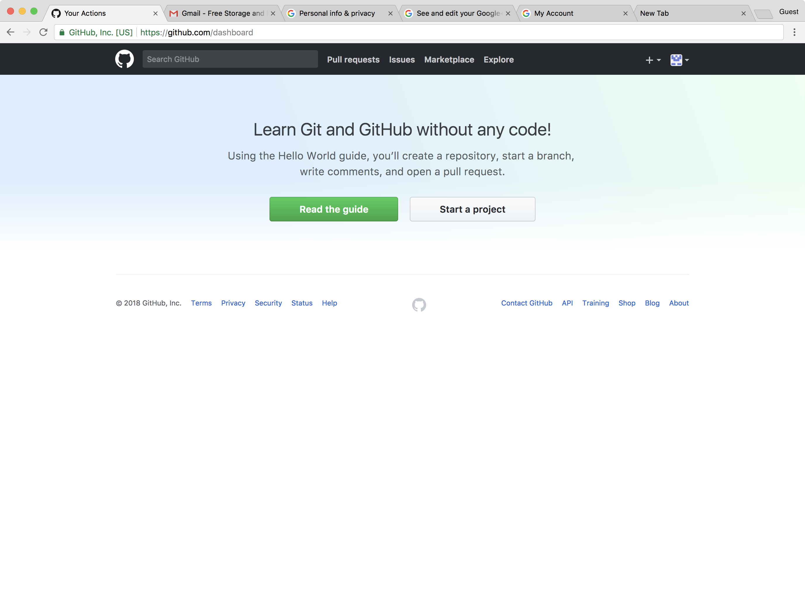
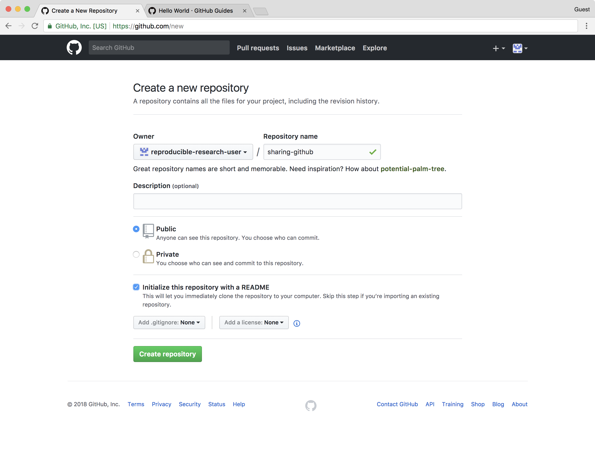

> ## Important notice
> This lesson has been taken from [https://reproducible-science-curriculum.github.io/sharing-RR-Jupyter/](https://reproducible-science-curriculum.github.io/sharing-RR-Jupyter/)
> and is distributed under the <a href="https://creativecommons.org/licenses/by/4.0/">Creative Commons Attribution license</a>.
> The following is a human-readable summary of (and not a substitute for) the <a href="https://creativecommons.org/licenses/by/4.0/legalcode">full legal text of the CC BY 4.0 license</a>.
{: .callout}

# Share your jupyter dashboards online using Github

In this lesson we will learn:

- How to create a new project repository on Github. A repository is a central location where source code and data is stored and managed
- How to add a file to the repository using GitHub's web interface
- How to visually confirm that files have been added to the repository and preview files using the GitHub interface
- The concepts of creating a public repository for the purpose of sharing your research data

## GitHub

GitHub is a development platform where we "_can host and review code, manage projects, and build software._" GitHub hosts source code for 75+ million projects including the `pandas` package we have been using among many others.

Make sure you have a (free) account otherwise follow our <a href="https://annefou.github.io/jupyter_dashboards/setup.html">setup instructions</a>.

### 1. Create a new repository

- Click on _Start a project_ as shown below.

> ## Create a new repository:
>
> - Add a repository name. We choose to name our repository `sharing-github`.
> - Personal GitHub accounts require that projects be _public_.
> - Check the _Initialize this repository with a README_ option.
> - Add a **license** (for instance BSD 2-Clause "Simplified" License or BSD 3-Clause or MIT license)
> - Click the green _Create repository_ button.
{: .challenge}

After creating the new repository, we will be taken to the project homepage (shown below).

If we click on the GitHub icon at the top of the page, we will go to our GitHub homepage.

Our GitHub homepage will now show the new repository under _Your repositories_ (as shown below).

**Congratulations!!** We now have created our repository for hosting our jupyter dashboards!

### 2. Upload our previous working notebook to the repository

In anticipation of our next lesson on sharing using the capability of [Binder](https://mybinder.org), we need to upload the notebook that we have been working on. To do this we will repeat many of the steps above.

> ## Upload our file:
> - Return to `sharing-github` repository on GitHub
> - Click on the _Upload file_ button
> - Drag and drop the data analysis notebook completed in the previous lesson or click the _choose your files_ link to select the notebook.
>    - We will see any files that _we_ have uploaded at the bottom of the drag and drop area.
> - Add a message describing the change we are about to make.
>    - Typing "Added data analysis notebook" in the subject field.
>    - We can either add the same message below in the extended description or leave it blank.
> - Click on _Commit changes_ button to complete the upload.
>
{: .challenge}

After commiting the change we should see that there are now three files in the repository: 1) the README and 2) the LICENSE and 3) our new data analysis notebook.

# Authoring & Citation

In addition to LICENSE, it is recommended to add:

- **AUTHORS**: file containing the list of contributors
- **CITATION**: file containing information on how to cite your work, including a DOI (Digital Object Identifier)

## List of authors

A GitHub repository is very often created by an individual user so adding the list of authors is very important.

> ## Add a new file AUTHORS in your repository
>
> - Go to your repository in your web browser
> - Click on "Create new file" and name your file `AUTHORS`
> - Add the list of authors/contributors and commit your changes
>
{: .challenge}

## Make your GitHub repository citable (<a href="https://en.wikipedia.org/wiki/Digital_object_identifier#">DOI</a>)

Your GitHub repository contains your scientific workflow, your programs/software, datasets (or links to your datasets) and jupyter dashboards so it is important to make the work you share on GitHub citable by archiving your GitHub repository to get a DOI. You may have a Data archive in your University or you may use the data archiving tool <a href="https://zenodo.org/">Zenodo</a>.

### Login to Zenodo

- Go to <a href="https://zenodo.org/">https://zenodo.org/</a> and click on `Log in` (not `Sign up`)
- Choose `Log in with GitHub`

- Zenodo will redirect you back to GitHub and ask you to give Zenodo the permissions it needs. click `Authorize Application`:

**Source**: <a href="https://guides.github.com/activities/citable-code/zenodo-authorize.png">https://guides.github.com/activities/citable-code/zenodo-authorize.png</a>

### Get a DOI for your Github repository

- When sucessfully login to Zenodo, click on your username (top right) and select `GitHub`

Then
- Select the repository `sharing-github` and flip the switch to `on`
- Create a <a href="https://help.github.com/articles/creating-releases/">Release on Github</a>
- Then go to your GitHub repository and click on `settings` and select `Webhooks`

Your GitHub repository is now linked to Zenodo and you will automatically get a DOI:

### Add your DOI to your GitHub repository

- Get your DOI badge on Zenodo and copy your DOI information (selection markdown)

- Go to your GitHub repository and edit your README file and add your DOI

# Limitations

Sharing your GitHub repository along with your jupyter notebooks/dashboards is an important step for making your research reproducible. However, anyone willing to rerun your programs/dashboards/notebooks need to get the same computational environment (python, additional python packages, etc.).

The next section (using <a href="https://github.com/jupyterhub/binderhub">Binder</a>) will show you how to make your research fully reproducible, offering users the same computational environment with no efforts.

> ## Where to find more about GitHub
> To learn more about GitHub you can review one or more of these additional (external) resources:
> - GitHub Guide - [Hello World](https://guides.github.com/activities/hello-world/)
> - All the [GitHub guides](https://guides.github.com)
> - Hubspot [`git` and GitHub tutorial](https://product.hubspot.com/blog/git-and-github-tutorial-for-beginners)
> - Plurlsight's [GitHub beginner's guide](https://www.pluralsight.com/blog/software-development/github-tutorial)
> - Code School's [GitHub tutorial](https://www.codeschool.com/courses/mastering-github)
{: .discussion}

> ## More about Git version control
> If you would like to learn about source code version control using the `git` software, the `git` in GitHub, please see these resources:
> - Try this 15 minute interactive  [`git` tutorial](https://try.github.io/)
> - Try some additional `git` exercises [here](https://gitexercises.fracz.com)
{: .discussion}
